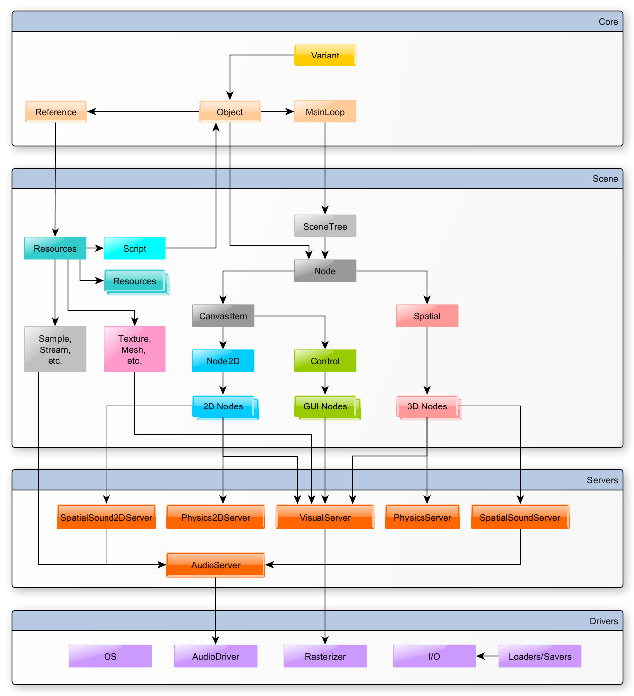

# Godot

Godot 的特色是灵活与小巧。

- 组合与聚合
- 继承



## `.gitignore`

``` gitignore
# Godot-specific ignores
.import/
export.cfg
export_presets.cfg

# Imported translations (automatically generated from CSV files)
*.translation

# Mono-specific ignores
.mono/
data_*/
```

## 场景编辑器

- `Ctrl + A` Add Node
- `Ctrl + D` Duplicate
