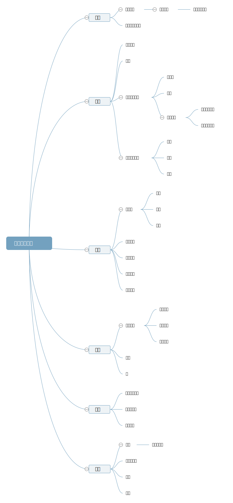

# 编程语言常识

> Practice to hack.

- 开放闭合原则 Open-Closed Principle “对拓展开放，对修改关闭”。

## 编码原则

1. `_`用于隐藏变量。

## 编程经验

1. **不要过度依赖默认的设置或行为** *过度依赖* 默认的设置或行为可能给后来维护代码的人造成理解上的困难，当默认行为发生更改或者偏离手册上的描述时，尝试跟踪问题会花费掉大量的时间。
