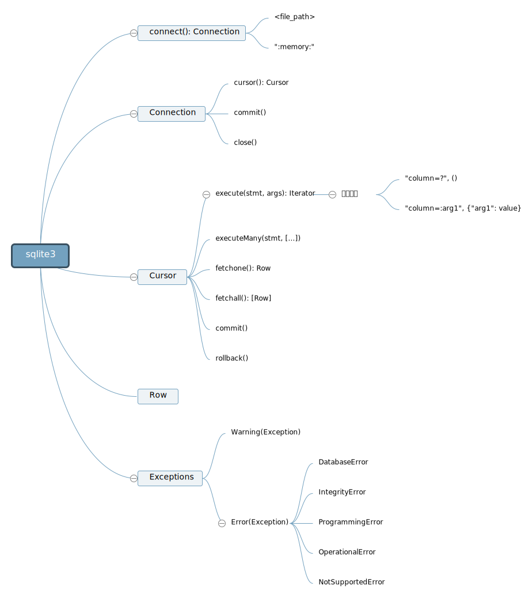

# Python 数据库

## sqlite3

``` py
import sqlite3
```



- 与 SQLite 的 SQL 语法相关的内容，应当参见[sqlite3笔记](../../../../platform/sqlite/README.md)
- Python sqlite3 库[文档](https://docs.python.org/3/library/sqlite3.html)
