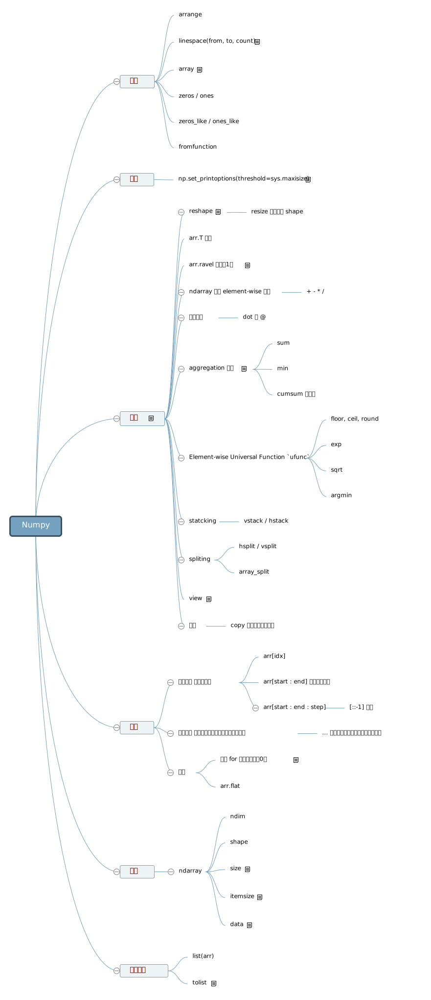

# NumPy 常用操作

``` py
import numpy as py
```



## 创建数组

``` py
one_dimensional_array = np.array([1.2, 2.4, 3.5, 4.7, 6.1, 7.2, 8.3, 9.5])
two_dimensional_array = np.array([[6, 5], [11, 7], [4, 8]])
```

``` py
sequence_of_integers = np.arange(5, 12)
# [ 5  6  7  8  9 10 11]
```

``` py
random_integers_between_50_and_100 = np.random.randint(low=50, high=101, size=(6))
random_floats_between_0_and_1 = np.random.random([6])
```

## 操作数据

可以对 NumPy 数组使用基本的 Python 操作符，这些操作会应用到元素身上。

``` py
random_floats_between_2_and_3 = random_floats_between_0_and_1 + 2.0
random_integers_between_150_and_300 = random_integers_between_50_and_100 * 3
```

## 神奇而有用的技巧

- "Combine different vectors so as to obtain the result for each n-uplet" 借助广播机制的可以做到有用的事情的 _ix 函数 [ix()](https://numpy.org/doc/stable/user/quickstart.html#the-ix-function)

---

## 参考资料

- 涵盖了大多数使用场景的 [NumPy QuickStart](https://numpy.org/doc/stable/user/quickstart.html)
