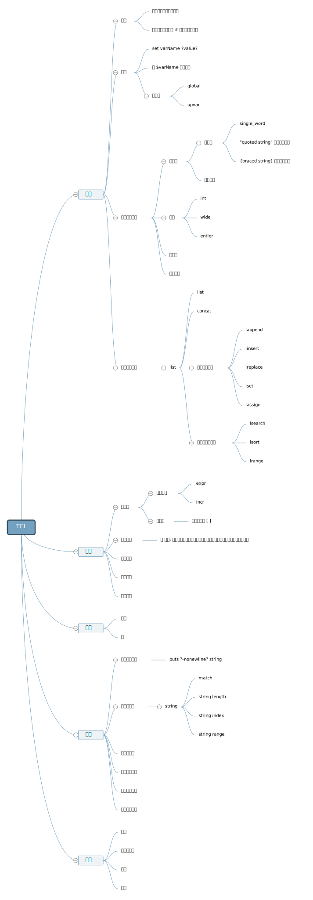

# TCL

- Tcl — Tool Command Language
- Tk — The Tk toolkit for GUI development

指令

- `tclsh`
- `wish` 图形化 Shell
- `% puts $tcl_version`
- `% info commands`

## 基本概念

在 TCL 中一切都是列表！

在 TCL 中一切都是命令或字符串！（没有指令、字符串或语法之间的区别，他们都是一样的。他们的作用取决于他们在程序中出现的先后顺序。）

在 TCL 中一切都可以表达成字符串的形式！（尽管在语言内部可能以列表、整数、浮点数或其他形式储存。）

- 如果习惯了 C++ 或 Python，那么需要注意通过变量名引用变量时需要 `$` 符号。
- 如果习惯了 PHP，那么需要注意不要在参数列表或 List 中用逗号分隔参数或元素 `,`。
- 如果犯了上述错误，请默念“在 TCL 中一切都是列表！”三次。

## 参考资料

- [Documentation and Tutorial](https://core.tcl-lang.org/docs.html)
- [TCL Wiki](https://wiki.tcl-lang.org/welcome)
- [TCL Wiki 教程](https://wiki.tcl-lang.org/page/Tcl+Tutorial+Lesson+0)
- [在官方网站的上的 TCL 教程（同 TCL Wiki 教程）](https://www.tcl.tk/man/tcl8.5/tutorial/tcltutorial.html)

## 练习

- 在学习 TCL 基础时，不妨在 CodeChef 上进行一些编程练习。[School 难度](https://www.codechef.com/problems/school/)的题目非常适合用于练习 TCL 基础。
